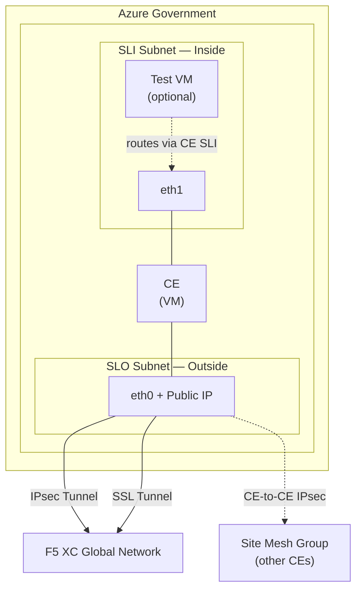
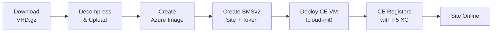

# F5 XC SMSv2 Customer Edge — Azure Government

Deploy an [F5 Distributed Cloud](https://docs.cloud.f5.com/) Secure Mesh Site v2 (SMSv2) Customer Edge node in **Azure Government**.

The F5 XC CE marketplace image is not available in Azure Gov, so this project automatically downloads the VHD from the F5 XC image repository and uploads it to your Azure Gov Storage account.

## Architecture



## Prerequisites

- **Terraform** >= 1.3
- **Azure CLI** logged in to Azure Government (`az cloud set --name AzureUSGovernment`)
- **Azure Service Principal** with **Contributor** role on the target subscription (needed for resource management and storage account key access)
- **F5 XC tenant** with API credentials (.p12 file) — password provided via `VES_P12_PASSWORD` env var
- **CE image URL** from F5 XC Console (see step 3 below)
- **Local tools**: `curl`, `gunzip`, `jq` (used by provisioner and helper scripts)

### CE VM Sizing

| Resource | Minimum |
|----------|---------|
| vCPUs    | 8       |
| RAM      | 32 GB   |
| Disk     | 80 GB   |

### Provider Versions

| Provider | Constraint | Tested With |
|----------|------------|-------------|
| [azurerm](https://registry.terraform.io/providers/hashicorp/azurerm/latest) | >= 3.49.0 | 4.61.0 |
| [volterra](https://registry.terraform.io/providers/volterraedge/volterra/latest) | >= 0.11.42 | 0.11.47 |
| [random](https://registry.terraform.io/providers/hashicorp/random/latest) | >= 3.4.0 | 3.8.1 |

## Quick Start

### 1. Azure Gov Login + Service Principal

```bash
source ./scripts/setup-azure-gov.sh
```

This will:
- Switch Azure CLI to the `AzureUSGovernment` cloud
- Log in interactively and confirm the subscription
- Create a Service Principal with **Contributor** role
- Export `ARM_*` environment variables for Terraform

### 2. Set the F5 XC P12 Password

```bash
export VES_P12_PASSWORD="your-p12-password"
```

### 3. Get the CE Image URL

The CE VHD image URL is not available via API — it must be obtained from the F5 XC Console. Create a temporary site to retrieve the URL, then delete it:

1. In the F5 XC Console, navigate to **Multi-Cloud Network Connect > Manage > Site Management > Secure Mesh Sites v2**
2. Click **Add Secure Mesh Site v2**
3. Fill in a temporary name (e.g., `temp-image-url`) and select **Azure** as the provider
4. After creation, click the **...** menu on the site row > **Copy Image Name**
5. Paste the URL into `vhd_download_url` in your `terraform.tfvars`
6. **Delete the temporary site** — Terraform will create the actual site object during `apply`

The URL looks like:
```
https://vesio.blob.core.windows.net/releases/rhel/9/x86_64/images/securemeshV2/azure/f5xc-ce-<version>.vhd.gz
```

> **Note:** The image URL is version-specific. When upgrading to a newer CE version, repeat this process to get the updated URL.

### 4. Configure and Deploy

```bash
cp terraform.tfvars.example terraform.tfvars
# Edit terraform.tfvars with your values

terraform init
terraform plan
terraform apply
```

On first apply, Terraform will automatically:
1. Download the `.vhd.gz` from the F5 XC image repo (~3 GB compressed)
2. Decompress it (~79 GB uncompressed VHD)
3. Upload it as a Page Blob to your Azure Gov Storage account
4. Create an Azure Image from the VHD
5. Deploy the CE VM with dual NICs, accelerated networking, and a registration token via cloud-init

> **Note:** The first apply takes **15-45 minutes** due to the VHD download, decompression, and upload. Subsequent applies skip the download/upload if the blob already exists in storage. You can also pre-stage the VHD using `scripts/upload-vhd.sh` if you prefer to separate the image upload from the infrastructure deployment.

### 5. Verify Registration

After boot, the CE will automatically register with the F5 XC control plane. This process may take **15-30 minutes** as the CE performs initial setup. Monitor progress in the F5 XC Console:

**Multi-Cloud Network Connect > Overview > Sites** — site should progress to **Online**.

> The registration token is valid for **24 hours**. If it expires, re-run `terraform apply` to generate a new one.

### 6. Post-Registration: Site Mesh Group Setup

When `enable_site_mesh_group = true` (the default), the site is configured for site-to-site connectivity over the SLO public IP. After the CE registers, complete these manual steps in the F5 XC Console:

1. Navigate to **Multi-Cloud Network Connect > Manage > Site Management > Secure Mesh Sites v2**
2. Select the site > **Edit** > **Node Information**
3. Set the **Public IP** field to the SLO public IP address (`terraform output slo_public_ip`)
4. On the SLO interface (eth0), enable **Use for Site to Site Connectivity**
5. Save changes

These node-level properties are populated by the CE during registration and cannot be managed declaratively via Terraform.

### 7. SSH Access

The CE VM admin username is `cloud-user`. The default login shell is the **SiteCLI** (an interactive management console), not bash:

```bash
ssh cloud-user@$(terraform output -raw slo_public_ip)
```

> **Note:** The SLO NSG does **not** include an inbound SSH rule by default. Add one manually for debugging if needed — do not commit SSH inbound rules to the template.

From SiteCLI, you can run host commands via `execcli`:
```
>>> execcli journalctl -u vpm --no-pager
>>> execcli crictl-images
```

## Inputs

| Name | Description | Default | Required |
|---|---|---|---|
| `f5xc_api_url` | F5 XC tenant API URL | — | **yes** |
| `f5xc_api_p12_file` | Path to API .p12 credential file | — | **yes** |
| `location` | Azure Gov region | `usgovvirginia` | no |
| `resource_group_name` | Existing resource group (null = create new) | `null` | no |
| `vnet_name` | Existing VNet (null = create new) | `null` | no |
| `vnet_address_space` | VNet address space (when creating new) | `10.0.0.0/16` | no |
| `outside_subnet_name` | Existing SLO subnet (null = create new) | `null` | no |
| `outside_subnet_cidr` | SLO subnet CIDR (when creating new) | `10.0.1.0/24` | no |
| `inside_subnet_name` | Existing SLI subnet (null = create new) | `null` | no |
| `inside_subnet_cidr` | SLI subnet CIDR (when creating new) | `10.0.2.0/24` | no |
| `vhd_download_url` | CE VHD download URL from Console (see step 3) | `null` | recommended |
| `vhd_storage_account_name` | Existing storage account (null = create new) | `null` | no |
| `vhd_storage_container_name` | Blob container name | `f5xc-ce-images` | no |
| `vhd_blob_name` | VHD blob name (auto-derived from URL if omitted) | `null` | no |
| `site_name` | SMSv2 site name (DNS-1035 compliant) | — | **yes** |
| `site_description` | Site description in F5 XC | `F5 XC SMSv2 CE in Azure Government` | no |
| `instance_type` | Azure VM size (min 8 vCPU / 32 GB RAM) | `Standard_D8s_v4` | no |
| `os_disk_size_gb` | OS disk size in GB | `128` | no |
| `ssh_public_key` | SSH public key for `cloud-user` access | — | **yes** |
| `enable_site_mesh_group` | Enable site mesh group on SLO for site-to-site connectivity | `true` | no |
| `slo_security_group_id` | Existing NSG ID for SLO NIC (null = create new) | `null` | no |
| `sli_security_group_id` | Existing NSG ID for SLI NIC (null = create new) | `null` | no |
| `slo_private_ip` | Static SLO IP (null = DHCP) | `null` | no |
| `sli_private_ip` | Static SLI IP (null = DHCP) | `null` | no |
| `create_public_ip` | Create a Standard SKU public IP on the SLO NIC | `true` | no |
| `deploy_test_vm` | Deploy Ubuntu test VM on SLI subnet | `false` | no |
| `test_vm_size` | Azure VM size for test VM | `Standard_B2s` | no |
| `tags` | Azure resource tags | `{}` | no |

## Outputs

| Name | Description |
|---|---|
| `site_name` | F5 XC site name |
| `site_token` | Registration token (sensitive) |
| `resource_group_name` | Azure resource group (created or existing) |
| `vm_name` | Azure VM name |
| `slo_private_ip` | SLO (outside) private IP |
| `sli_private_ip` | SLI (inside) private IP |
| `slo_public_ip` | SLO public IP (if enabled) |
| `image_id` | Azure Image resource ID |
| `test_vm_private_ip` | Test VM private IP on SLI (if deployed) |

## File Structure

```
.
├── versions.tf              # Providers (azurerm, volterra, random)
├── variables.tf             # Input variables
├── main.tf                  # Azure infra (NSGs, NICs, PIP, VM)
├── f5xc.tf                  # SMSv2 site, registration token, cloud-init
├── image.tf                 # VHD download/upload + Azure Image
├── outputs.tf               # Outputs
├── terraform.tfvars.example # Example variable values
├── scripts/
│   ├── setup-azure-gov.sh   # Azure Gov login + SPN creation
│   └── upload-vhd.sh        # Standalone VHD upload helper
├── creds/                   # .p12 credential files (gitignored)
└── .gitignore
```

## How It Works



1. **`terraform_data.vhd_upload`** — Downloads the VHD.gz from the F5 XC image repo, decompresses it, and uploads to Azure Gov Storage as a Page Blob using storage account key auth. Skips entirely if the blob already exists.
2. **`azurerm_image.ce`** — Creates an Azure Image from the uploaded Page Blob VHD.
3. **`volterra_securemesh_site_v2`** — Creates the SMSv2 site object in F5 XC with `azure { not_managed {} }` (manual/unmanaged deployment). **Offline Survivability Mode** is enabled by default, allowing the CE to continue processing traffic for up to 7 days if connectivity to the F5 XC control plane is lost.
4. **`volterra_token`** — Generates a JWT registration token (`type = 1`) bound to the site name. The token ID is the JWT itself.
5. **Cloud-init** — Writes the JWT to `/etc/vpm/user_data` on the VM via `custom_data`.
6. **CE boots** — VPM reads the JWT (which carries cluster name, tenant, and registration endpoints), and auto-registers with the F5 XC control plane over IPsec/SSL tunnels.

### Infrastructure Model

By default, the template creates **all** Azure infrastructure (resource group, VNet, subnets, storage account, NSGs). To deploy into an **existing** environment, set the corresponding variables to reference your pre-existing resources:

- `resource_group_name` — existing RG name (otherwise creates `<prefix>-rg`)
- `vnet_name` — existing VNet name (otherwise creates `<prefix>-vnet`)
- `outside_subnet_name` / `inside_subnet_name` — existing subnet names (otherwise creates `<prefix>-slo` / `<prefix>-sli`)
- `vhd_storage_account_name` — existing storage account (otherwise creates a new one)
- `slo_security_group_id` / `sli_security_group_id` — existing NSG IDs (otherwise creates new NSGs)

**Route Tables** — Not managed by this template. Configure UDRs on the SLI subnet externally if you need to route workload traffic through the CE.

**NSGs** — By default, the template creates lightweight NSGs for the SLO and SLI NICs. In enterprise environments with centrally managed NSGs, pass existing NSG IDs via `slo_security_group_id` and `sli_security_group_id` to skip NSG creation entirely.

### Networking Details

- **SLO (eth0)** — Outside interface, first NIC. Outbound internet required for F5 XC registration. Optional Standard SKU public IP. Default NSG allows all outbound.
- **SLI (eth1)** — Inside interface, second NIC. Used for LAN/workload traffic. Default NSG allows all inbound.
- Both NICs have **accelerated networking** and **IP forwarding** enabled.
- Resource names include a random 4-character hex suffix to avoid conflicts.
- Boot diagnostics are enabled (uses managed storage).

### Storage Authentication

The VHD upload provisioner authenticates to Azure Storage using **storage account keys** (retrieved via `az storage account keys list`). This requires the **Contributor** role on the resource group — no additional RBAC data-plane roles (e.g., Storage Blob Data Contributor) are needed.

### Pre-staging the VHD

If you prefer to upload the VHD separately (before or outside of Terraform), use the standalone helper:

```bash
./scripts/upload-vhd.sh \
  --url "https://vesio.blob.core.windows.net/releases/.../f5xc-ce-<version>.vhd.gz" \
  --storage-account mystorageacct \
  --resource-group my-rg
```

Then omit `vhd_download_url` in your tfvars and set `vhd_blob_name` to the uploaded blob name.

## Cleanup

```bash
terraform destroy
```

This removes all Terraform-managed resources (VM, NICs, NSGs, PIP, Azure Image, F5 XC site and token). The VHD blob in storage is **not** deleted by Terraform — remove it manually if desired:

```bash
az storage blob delete \
  --account-name <storage-account> \
  --container-name f5xc-ce-images \
  --name <blob-name> \
  --auth-mode login
```

## References

- [volterra_securemesh_site_v2](https://registry.terraform.io/providers/volterraedge/volterra/latest/docs/resources/volterra_securemesh_site_v2)
- [SecureMesh Site v2 API](https://docs.cloud.f5.com/docs-v2/api/views-securemesh-site-v2)
- [Deploy SMSv2 in Azure (ClickOps)](https://docs.cloud.f5.com/docs-v2/multi-cloud-network-connect/how-to/site-management/deploy-sms-az-clickops)
- [SMSv2 Automation (DevCentral)](https://community.f5.com/kb/technicalarticles/how-to-deploy-an-f5xc-smsv2-site-with-the-help-of-automation/342198)
- [CE Site Sizing](https://docs.cloud.f5.com/docs-v2/multi-cloud-network-connect/reference/ce-site-sizing)
- [CE IP Address and Domain Reference](https://docs.cloud.f5.com/docs-v2/multi-cloud-network-connect/reference/ce-ip-dom-ref)
